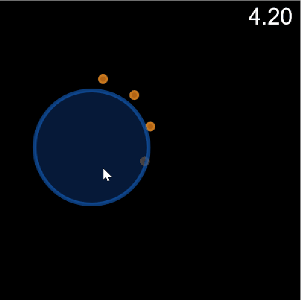
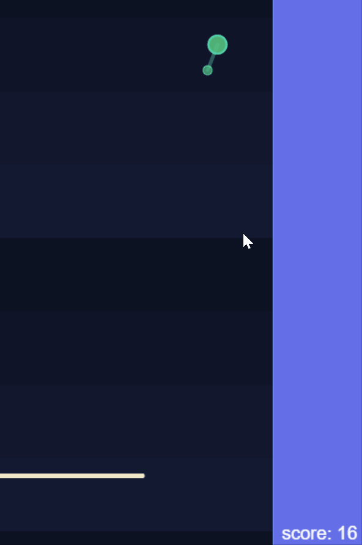
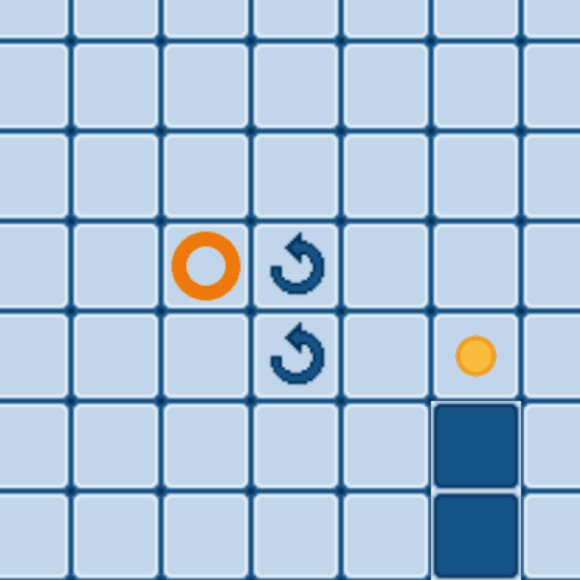
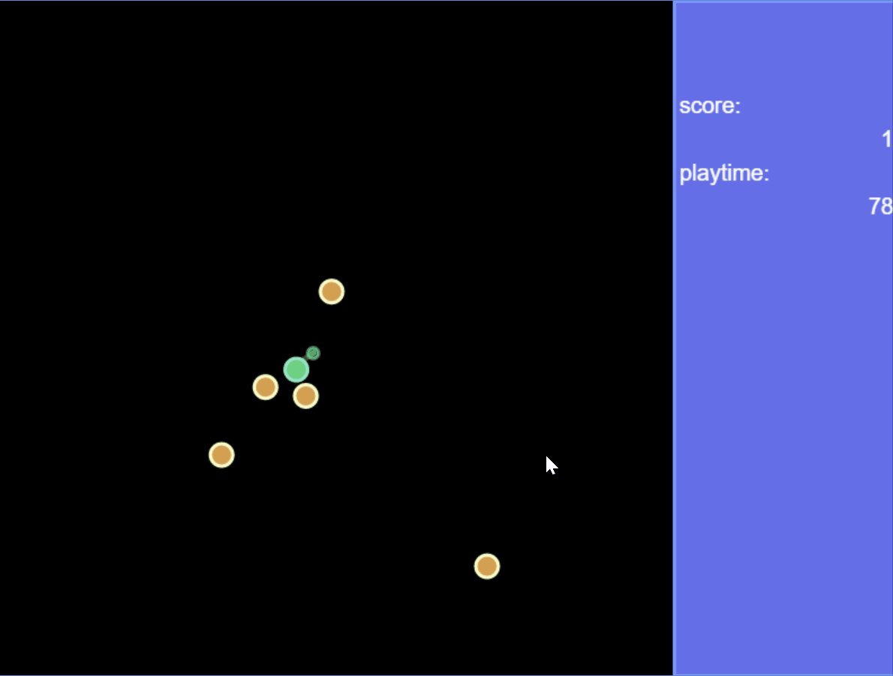
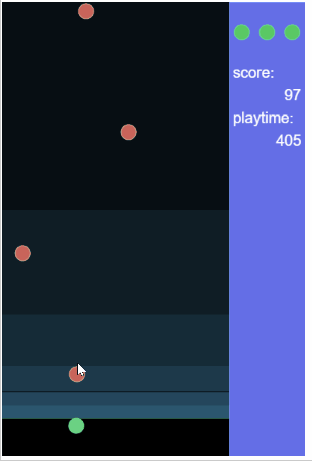

# traP3jam

traP3jam(3時間ゲームジャム)でつくったゲーム置き場

## traP3jam とは

参考記事: [ゲームを作ろう！ traP3jam【新歓ブログリレー2017 4日目】 | traP](https://trap.jp/post/174/)

> [#traP3jam](https://twitter.com/search?vertical=default&q=%23traP3jam)とは、「3時間でゲームをつくろう！」という企画です。
>
> ハッカソン(Hackathon)とは、その場で出されたお題に沿った作品を1日や2日といった短期間で制作するというイベントのこと。
ゲームジャム(GameJam)は、それのゲーム制作版みたいなものです。
>
> traP主催の3時間GameJam・・・だからtraP3jam。
>
> お題が与えられるので、それに沿って作品を作り、みんなで提出します。
「実際に手を動かして何かつくってみる」ことで能力を高めることを目的としています。

## つくったげーむ

上から順に新しいです

### Oscillating Circle

- Date: 2017/08/28
- Theme: 「振動」
- URL: https://arkark.github.io/traP3jam/2017/0828

### Growth Ball

- Date: 2017/06/11
- Theme: 「成長」
- URL: https://arkark.github.io/traP3jam/2017/0611

### the Fall

- Date: 2017/05/04
- Theme: 「速度」
- URL: https://arkark.github.io/traP3jam/2017/0504

### Burning D-man and Gopher

- Date: 2017/03/21
- Theme: 「相反する2つのもの」
- URL: https://arkark.github.io/traP3jam/2017/0321

### Rotation Cross

- Date: 2017/02/20
- Theme: 「+」
- URL: https://arkark.github.io/traP3jam/2017/0220

### Spread Circle

- Date: 2017/02/13
- Theme: 「うつる」
- URL: https://arkark.github.io/traP3jam/2017/0213

### Just Shot

- Date: 2017/01/13
- Theme: 「限界」
- URL: https://arkark.github.io/traP3jam/2017/0113

